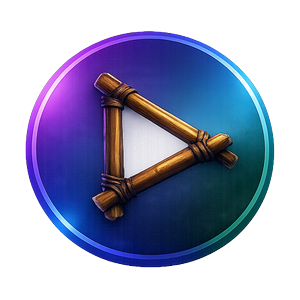

  

<h1 align="center">Cleario</h1>

  A simple WinUI media player powered by addons with metadata browsing

   Stremio Addon support • Local playback • Clean interface

  
  
  

  
  

---

## About

Cleario is a addon supported media app inspired by [Stremio](https://www.stremio.com/) built for browsing, organizing, and playing media.  

---

## Features

- Movie and series metadata (Cinemeta)
- Continue watching
- Library tracking
- Local file playback
- Calendar
- Subtitle selection
- Audio track selection
- Poster size settings
- Poster hover info
- Next episode popup
- Manage addons and home catalogs
- Discord Rich Presence
- Trakt integration
- Stremio Addon Support
- MPV and LibVLC Playback Engine

---

## Installation

### Windows

Download the latest version from the [GitHub Releases](https://github.com/HadgeOriginal/Cleario/releases) page.

---

## Legal Disclaimer

Cleario is a media player and client-side interface.

Cleario does not host, store, upload, distribute, sell, or provide any media content. Cleario does not include or provide movies, TV shows, live channels, streams, torrents, magnet links, or other copyrighted content.

Any media, metadata, streams, links, addons, or external sources accessed through Cleario are provided by the user or by third-party services. Cleario is not responsible for the availability, legality, accuracy, safety, or content of any third-party addon, source, stream, or metadata provider.

Users are solely responsible for ensuring that they have the legal right to access any content they play through Cleario. Cleario should only be used with content that the user owns, has permission to access, or is legally available in their region.
Cleario is not affiliated with, endorsed by, sponsored by, or connected to Stremio or any third-party addon provider.

All trademarks, logos, names, and brands belong to their respective owners.

---

## Built With

- C#
- WinUI
- Windows App SDK
- .NET 8
- LibVLCSharp
- VideoLAN LibVLC
- CommunityToolkit.Mvvm

## License

Cleario is available under a custom non-commercial license.

You may use, fork, modify, and share Cleario for free, but you may not sell it,
charge for it, include it in paid products, or commercially exploit it.

Forks must clearly say they are unofficial and must not use Cleario branding in
a way that makes them look official.

See [LICENSE](LICENSE) for details.
